# Unreal Engine Project "Heartbeat" &ndash; README

* Author: Copyright 2023 Roland Bruggmann aka brugr9
* Profile on UE Marketplace: [https://www.unrealengine.com/marketplace/profile/brugr9](https://www.unrealengine.com/marketplace/profile/brugr9)
* Profile on Epic Developer Community: [https://dev.epicgames.com/community/profile/PQBq/brugr9](https://dev.epicgames.com/community/profile/PQBq/brugr9)

---

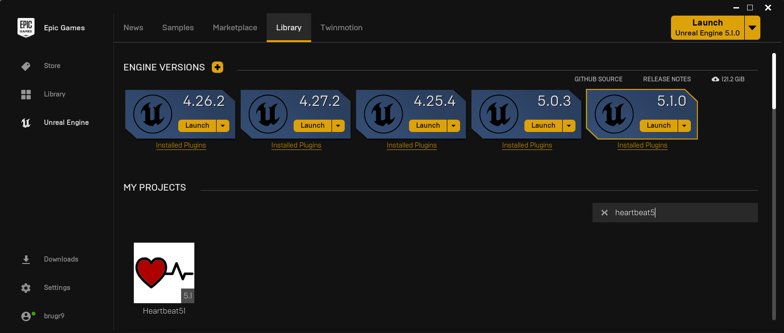

Unreal Engine Project "Heartbeat" &mdash; Heart Rate Monitoring Integration

## Description

An Unreal&reg; Engine project as proof-of-concept for receiving physiological data from Polar&reg; H10 heart rate monitor via MQTT.

* Index Terms:
  * Physiological Measuring, Electrocardiogram (ECG), Heart Rate (HR)
  * Integration, Messaging, Internet of Things (IOT), Machine to Machine (M2M)
* Technology:
  * Unreal&reg; Engine (UE), Polar&reg; H10 HR Sensor with Chest Strap, Polar&reg; Sensor Logger (PSL)
  * Bluetooth&reg; Low Energy (BLE), Message Queuing Telemetry Transport (MQTT)
  * Mosquitto&trade;, Wireshark&trade;, Android&trade; Debug Bridge (ADB)
  * Windows&trade; PowerShell&trade; (PS), Chocolatey Package Manager

---

<div style='page-break-after: always'></div>

## Table of Contents

<!-- Start Document Outline -->

* [1. Concept](#1-concept)
* [2. Setup](#2-setup)
  * [2.1. Firewall](#21-firewall)
  * [2.2. Wireshark](#22-wireshark)
  * [2.3. Unreal Engine](#23-unreal-engine)
    * [2.3.1. Plugin MQTT](#231-plugin-mqtt)
    * [2.3.2. MQTT Subscription](#232-mqtt-subscription)
  * [2.4. Mosquitto](#24-mosquitto)
  * [2.5. Android Debug Bridge](#25-android-debug-bridge)
  * [2.6. Polar Sensor Logger](#26-polar-sensor-logger)
* [3. Visualisation](#3-visualisation)
* [Appendix](#appendix)
  * [Acronyms](#acronyms)
  * [A. Attribution](#a-attribution)
  * [B. References](#b-references)
  * [C. Readings](#c-readings)
  * [D. Citation](#d-citation)
  * [E. Disclaimer](#e-disclaimer)

<!-- End Document Outline -->

<div style='page-break-after: always'></div>

## 1. Concept

We implement a general data flow as shown in listing 1.1.

*Listing 1.1.: General Data Flow*
> **Data Producer** &mdash;(*MQTT*)&rarr; **MQTT-Broker** &mdash;(*MQTT*)&rarr; **MQTT-Client**

We use system components as follows (for the specific data flow see Listing 1.2.):

* Data Producer:
  * Polar H10 Heart Rate (HR) Sensor with Chest Strap (cp. [1])
  * Android App "Polar Sensor Logger" (PSL) (cp. [2])
* MQTT-Broker "Mosquitto" as a Windows Service (cp. [6])
* "Unreal Engine" MQTT-Client from IOT-plugin "MQTT"

*Listing 1.2.: Specific Data Flow*
> Polar H10 &ndash;(*Polar BLE SDK*)&rarr; **Polar Sensor Logger** &ndash;(*MQTT*)&rarr; **Mosquitto** &ndash;(*MQTT*)&rarr; **Unreal Engine**

The following shows the setup in reverse order of the data flow: Unreal Engine and Mosquitto on Windows&mdash;were we furthermore use Wireshark and Android Debug Bridge&mdash;and Polar Sensor Logger on Android.

<div style='page-break-after: always'></div>

## 2. Setup

### 2.1. Firewall

MQTT standard port is 1883, we will use TCP as transport. In the Windows Defender Firewall allow TCP port 1883, e.g., by using an administrative PowerShell (see listing 2.1.).

*Listing 2.1.: Firewall Rule "Allow TCP Port 1883"*
```PowerShell
New-NetFirewallRule -DisplayName "Allow TCP Port 1883" -Direction inbound -Profile Any -Action Allow -LocalPort 1883 -Protocol TCP
```

### 2.2. Wireshark

We make use of Wireshark to monitor the MQTT messages sent over port 1883 (cp. [4] and [5]).

1. Launch an administrative PowerShell and install Wireshark, e.g., by using Chocolatey packet manager  (cp. [3], see listing 2.2.).
2. Startup Wireshark and filter TCP port 1883 (see listing 2.3. and figure 2.1.).

*Listing 2.2.: Use of Chocolatey to Install Wireshark*
```PowerShell
choco install wireshark
```

*Listing 2.3.: Wireshark Filter TCP Port 1883*
```
tcp.port == 1883
```

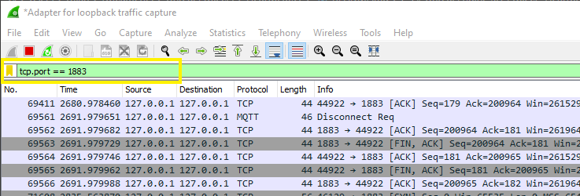
*Figure 2.1.: Wireshark Dissecting Port 1883*

### 2.3. Unreal Engine

Clone UE project "Heartbeat51" using git, e.g., by ```git clone https://github.com/brugr9/Heartbeat51.git``` and startup the project.

#### 2.3.1. Plugin MQTT

The UE project "Heartbeat51" makes use of built-in IOT plugin "MQTT" (see figure 2.2.). Note: With UE 5.1 as of January 2023, the plugin is not yet documented.

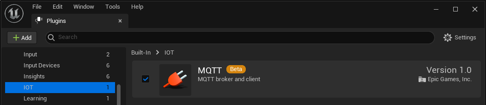
*Figure 2.2.: Unreal Engine Plugins Browser Tab with Built-in IOT Plugin "MQTT"*

#### 2.3.2. MQTT Subscription

Map `Map_PSL_Demo` holds a Blueprint instance `BP_PSL_Demo` (see figure 2.3.).

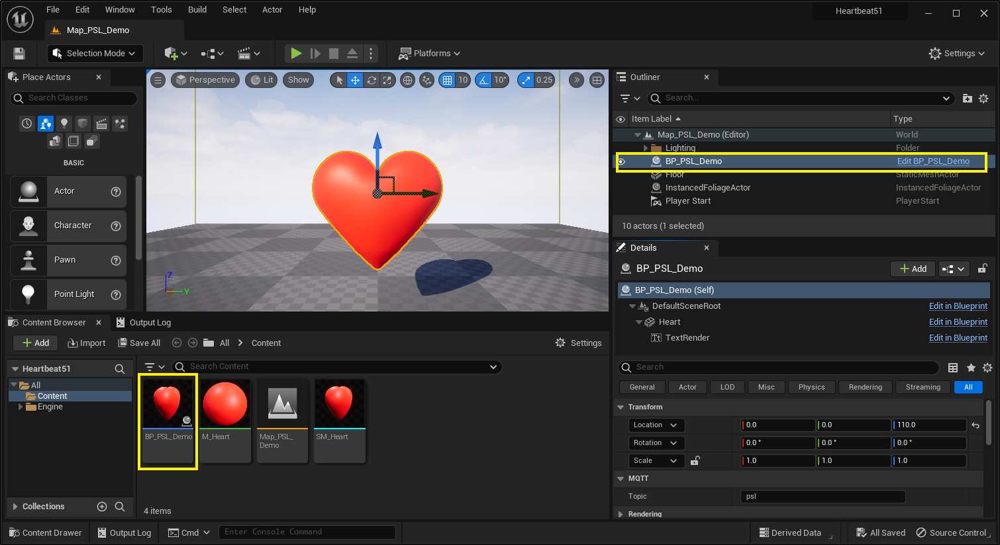
*Figure 2.3.: Map_PSL_Demo with BP_PSL_Demo instance also seen in the Outliner*

Blueprint `BP_PSL_Demo` has Actor-Components (see figure 2.4.):

* Static Mesh Component `Heart`
* Text Render Component `TextRender` with `Text > Text Render Color` set to red

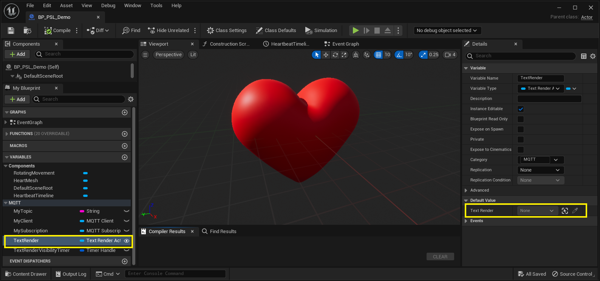
*Figure 2.4.: BP_PSL_Demo, Actor-Component TextRender*

Blueprint `BP_PSL_Demo` has variables:

* MQTT Client Object Reference `MqttClient`
* MQTT Subscription Object Reference `MqttSubscription`
* String `Topic`, Default Value set to `psl`

On BeginPlay the MQTT Client is crated and connected. If the connection was accepted, the topic `psl` is subscribed. `OnMessage` the received MQTTClientMessage Payload is evaluated (see figure 2.5.).

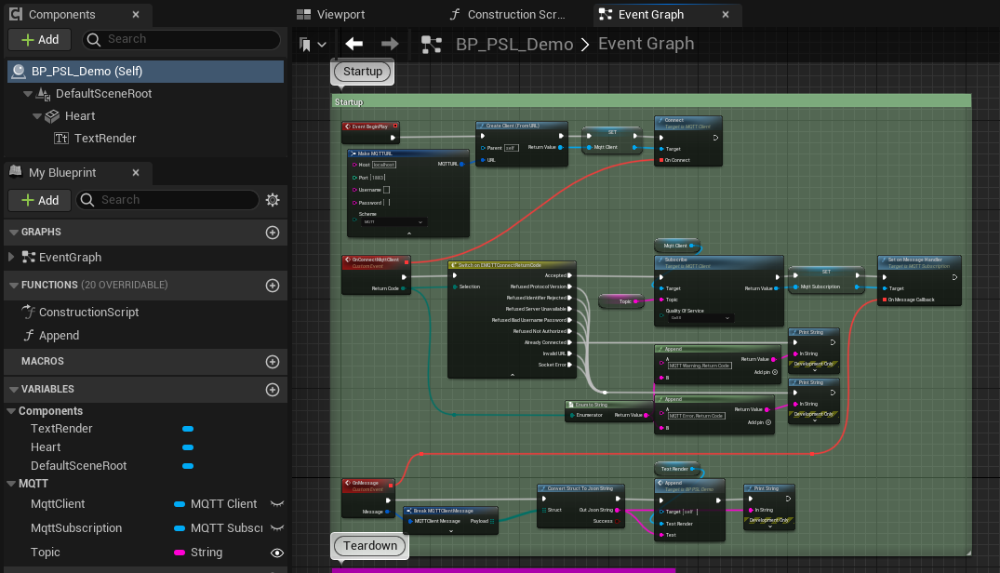
*Figure 2.5.: BP_PSL_Demo, Event Graph*

<div style='page-break-after: always'></div>

### 2.4. Mosquitto

Install Mosquitto MQTT-Broker (cp. [6]) and startup the Windows Service "Mosquitto Broker" (see figure 2.6.).

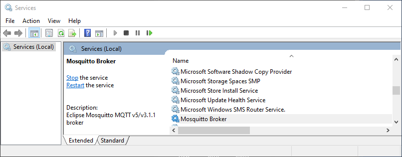
*Figure 2.6.: Mosquitto Broker as Windows Service*

<div style='page-break-after: always'></div>

### 2.5. Android Debug Bridge

On the Android enable USB Debugging mode (cp. [7]):

1. Launch the `Settings` application.
2. Tap the `About Phone` option (generally found near the bottom of the list).
3. Then tap the `Build Number` option _7 times_ to enable _Developer Mode_. You will see a toast message when it is done.
4. Now go back to the main `Settings` screen and you should see a new `Developer Options` menu you can access.
5. Go in there and enable the `USB Debugging` mode option.
6. Allow `USB Debugging prompt` on Android

On the PC setup Android Debug Bridge ADB (cp. [7]):

1. Launch an administrative PowerShell.
2. Ensure you have setup Android Debug Bridge, e.g., by using Chocolatey packet manager (cp. [3], see listing 2.4.).
3. Start the Android Debug Bridge and map TCP port 1883 bidirectional (cp. [8], see listing 2.5. and listing 2.6.).

*Listing 2.4.: Use of Chocolatey to Install ADB*
```PowerShell
choco install adb
```

*Listing 2.5.: ADB Startup*
```PowerShell
adb reverse tcp:1883 tcp:1883
```

*Listing 2.6.: ADB Startup Feedback*
```PowerShell
* daemon not running; starting now at tcp:5037
* daemon started successfully
```

<div style='page-break-after: always'></div>

### 2.6. Polar Sensor Logger

1. On the Android device install the "Polar Sensor Logger" (PSL) App (cp. [2])
2. Mount the Polar H10 sensor on the chest strap and wear the same.
3. Connect the Android device by USB to PC, prompt "Allow USB Debugging" > OK
4. On the Android device ...
   * 1. Activate Bluetooth
   * 2. Activate Location Service
   * 3. Start-up the "Polar Sensor Logger" App
     * 1. Under *"SDK data select:"* check `ECG` solely (cp. figure 2.7.)
     * 2. Under *"Settings:"* check `MQTT` solely (cp. figure 2.7.)
       * 1. In the pop-up *"MQTT-serttings"* configure (cp. figure 2.8.)
         * MQTT-broker address: `127.0.0.1`
         * Port: `1883`
         * Topic: `psl`
         * Client ID: e.g. `mqtt-psl-1`
       * 2. Hit `OK`
     * 3. Hit `Seek Sensor`, select listed sensor `Polar H10 12345678` (ID will differ), hit `OK`  (cp. figure 2.9.)

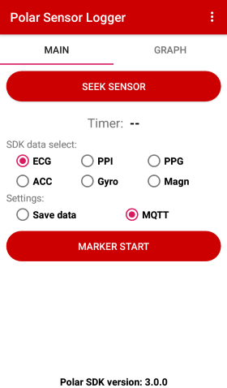 | 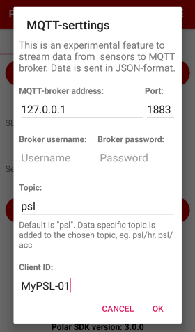 | 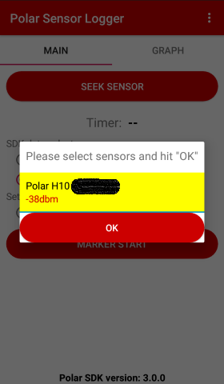
:-------------------------:|:-------------------------:|:-------------------------:
*Figure 2.7.: PSL, Main Tab* | *Figure 2.8.: PSL, Dialogue "MQTT Settings"* | *Figure 2.9.: PSL, Dialogue "Seek Sensor"*

<div style='page-break-after: always'></div>

## 3. Visualisation

In Unreal Editor with Level `Map_PSL_Demo` open, click the `Play` button &#9658; in the level editor to start Play-in-Editor (PIE). With receiving MQTT messages `BP_PSL_Demo` starts its visual feedback (see figure 3.1.). The MQTT plugin writes to the output log with the custom log category `LogMQTTCore` (see listings 3.1. and 3.2.). Wireshark dissecting port 1883 lists, e.g., the `Connect` command from the Unreal Engine MQTT client instance (see figure 3.2.).

TODO:
*Figure 3.1.: Animation Screenshot of Map_PSL_Demo PIE*

TODO:*Listing 3.1.: Output Log of Map_PSL_Demo starting PIE*
```log
[...]
LogWorld: Bringing World /Game/UEDPIE_0_Map_PSL_Demo.Map_PSL_Demo up for play (max tick rate 0)
LogWorld: Bringing up level for play took: 0.000743
LogOnline: OSS: Created online subsystem instance for: :Context_6
LogMQTTCore: VeryVerbose: Created MQTTConnection for 127.0.0.1
LogMQTTCore: Display: Created new Client, Num: 1
LogMQTTCore: Verbose: Set State to: Connecting
PIE: Server logged in
PIE: Play in editor total start time 0.094 seconds.
[...]
```

TODO:*Listing 3.2.: Output Log of Map_PSL_Demo stopping PIE*
```log
[...]
LogWorld: BeginTearingDown for /Game/UEDPIE_0_Map_PSL_Demo
LogMQTTCore: Verbose: Set State to: Disconnecting
LogWorld: UWorld::CleanupWorld for Map_PSL_Demo, bSessionEnded=true, bCleanupResources=true
LogSlate: InvalidateAllWidgets triggered.  All widgets were invalidated
LogPlayLevel: Display: Shutting down PIE online subsystems
[...]
```

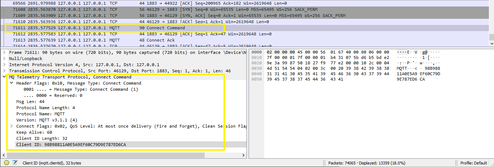
*Figure 3.2.: Wireshark Dissecting Port 1883, Connect Command from Unreal Engine MQTT Client Instance*

<div style='page-break-after: always'></div>

## Appendix

### Acronyms

* ADB &mdash; Android Debug Bridge
* BLE &mdash; Bluetooth Low Energy
* ECG &mdash; Electrocardiogram
* HR &mdash; Heart Rate
* IOT &mdash; Internet of Things
* M2M &mdash; Machine to Machine
* MQTT &mdash; Message Queuing Telemetry Transport
* PIE &mdash; Play-in-Editor
* POC &mdash; Proof-of-Concept
* PS &mdash; PowerShell
* PSL &mdash; Polar Sensor Logger
* UE &mdash; Unreal Engine

### A. Attribution

* The word mark Unreal and its logo are Epic Games, Inc. trademarks or registered trademarks in the US and elsewhere (cp. Branding Guidelines and Trademark Usage, URL: [https://www.unrealengine.com/en-US/branding](https://www.unrealengine.com/en-US/branding)).
* The word mark Polar and its logos are trademarks of Polar Electro Oy.
* Android is a trademark of Google LLC.
* The Bluetooth word mark and logos are registered trademarks owned by Bluetooth SIG, Inc.
* Windows and PowerShell are registered trademarks of Microsoft Corporation.
* The Chocolatey package manager software and logo are trade marks of Chocolatey Software, Inc.
* Mosquitto is a registered trade mark of the Eclipse Foundation.
* Wireshark and the "fin" logo are registered trademarks of the Wireshark Foundation (cp. Legal Information, Online: [https://www.wireshark.org/about.html](https://www.wireshark.org/about.html)).
* OASIS Message Queuing Telemetry Transport (MQTT) TC, Online: [https://www.oasis-open.org/committees/tc_home.php?wg_abbrev=mqtt](https://www.oasis-open.org/committees/tc_home.php?wg_abbrev=mqtt)
* 3D Model "Heart" ([https://skfb.ly/CCyL](https://skfb.ly/CCyL)) by phenopeia is licensed under [Creative Commons Attribution 4.0](http://creativecommons.org/licenses/by/4.0/).

### B. References

* [1] Polar Electro: **Polar H10**. Heart Rate Sensor with Chest Strap, Online: [https://www.polar.com/en/sensors/h10-heart-rate-sensor](https://www.polar.com/en/sensors/h10-heart-rate-sensor)
* [2] Jukka Happonen: **Polar Sensor Logger**. App on Google Play, Online: [https://play.google.com/store/apps/details?id=com.j_ware.polarsensorlogger](https://play.google.com/store/apps/details?id=com.j_ware.polarsensorlogger)
* [3] **Chocolatey** &ndash; The Package Manager for Windows. Online: [https://chocolatey.org/](https://chocolatey.org/)
* [4] Abhinaya Balaji: **Dissecting MQTT using Wireshark**. In: Blog Post, July 6, 2017. Catchpoint Systems, Inc. Online: [https://www.catchpoint.com/blog/wireshark-mqtt](https://www.catchpoint.com/blog/wireshark-mqtt)
* [5] Wireshark Documentation: **Display Filter Reference: MQ Telemetry Transport Protocol**, Online: [https://www.wireshark.org/docs/dfref/m/mqtt.html](https://www.wireshark.org/docs/dfref/m/mqtt.html)
* [6] **Eclipse Mosquitto** &ndash; An open source MQTT broker. Online: [https://mosquitto.org/](https://mosquitto.org/)
* [7] Skanda Hazarika: **How to Install ADB on Windows, macOS, and Linux**. July 28, 2021. In: XDA Developers. Online: [https://www.xda-developers.com/install-adb-windows-macos-linux](https://www.xda-developers.com/install-adb-windows-macos-linux)
* [8] Tushar Sadhwani: **Connecting Android Apps to localhost, Simplified**. April 17, 2021. In: DEV Community, Online: [https://dev.to/tusharsadhwani/connecting-android-apps-to-localhost-simplified-57lm](https://dev.to/tusharsadhwani/connecting-android-apps-to-localhost-simplified-57lm)

### C. Readings

* Ch&#281;&cacute;, A.; Olczak, D.; Fernandes, T. and Ferreira, H. (2015). **Physiological Computing Gaming - Use of Electrocardiogram as an Input for Video Gaming**. In: Proceedings of the 2nd International Conference on Physiological Computing Systems - PhyCS, ISBN 978-989-758-085-7; ISSN 2184-321X, pages 157-163. DOI: [10.5220/0005244401570163](http://dx.doi.org/10.5220/0005244401570163)

<div style='page-break-after: always'></div>

### D. Citation

To acknowledge this work, please cite

> Bruggmann, R. (2023): Unreal&reg; Engine 5.1 Project "Heartbeat" [Computer software]. Online: https://github.com/brugr9/heartbeat51

```bibtex
@software{Bruggmann_Heartbeat_2023,
  author = {Bruggmann, Roland},
  year = {2023},
  title = {{Unreal Engine 5.1 Project 'Heartbeat'}},
  url = {https://github.com/brugr9/heartbeat51}
}
```

### E. Disclaimer

This documentation has **not been reviewed or approved** by the *Food and Drug Administration FDA* or by any other agency. It is the users responsibility to ensure compliance with applicable rules and regulations&mdash;be it in the US or elsewhere.

---
<!-- Footer -->

[](https://creativecommons.org/licenses/by-sa/4.0/)

*Unreal&reg; Engine Project "Heartbeat"* &copy; 2023 by [Roland Bruggmann](https://about.me/rbruggmann) is licensed under [Creative Commons Attribution-ShareAlike 4.0 International](http://creativecommons.org/licenses/by-sa/4.0/)
