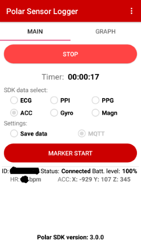

# Unreal Engine 5.1 Project "Heartbeat"

* Author: Copyright 2023 Roland Bruggmann aka brugr9
* Profile on UE Marketplace: [https://www.unrealengine.com/marketplace/profile/brugr9](https://www.unrealengine.com/marketplace/profile/brugr9)
* Profile on Epic Developer Community: [https://dev.epicgames.com/community/profile/PQBq/brugr9](https://dev.epicgames.com/community/profile/PQBq/brugr9)

---


Unreal Engine Project: "Heartbeat51", Heart Rate Monitoring Integration

## Description

An Unreal Engine project as Proof of Concept for receiving physiological data from Polar&reg; H10 heart rate Monitor using UE IOT-Plugin "MQTT".

* Index Terms: Sports Performance, Physiological Measuring, Heart Rate HR, Electrocardiogram ECG, Integration, Messaging, Internet of Things IoT, Machine to Machine M2M
* Technology: Polar&reg; H10 HR Sensor with Chest Strap, Bluetooth&reg;, Polar Sensor Logger PSL, MQTT, Unreal&reg; Engine

---

<div style='page-break-after: always'></div>

## Table of Contents

<!-- Start Document Outline -->

* [1. Concept](#1-concept)
* [2. Unreal Engine](#2-unreal-engine)
  * [2.1. Enable Plugin](#21-enable-plugin)
  * [2.2. MQTT Subscription](#22-mqtt-subscription)
* [3. Mosquitto](#3-mosquitto)
* [4. Polar Sensor Logger](#4-polar-sensor-logger)
  * [4.1. Setup Android Debug Bridge](#41-setup-android-debug-bridge)
  * [4.2. Setup Polar Sensor Logger](#42-setup-polar-sensor-logger)
* [5. Monitoring](#5-monitoring)
* [6. Data Visualisation](#6-data-visualisation)
* [A. Attribution](#a-attribution)
* [B. References](#b-references)
* [C. Readings](#c-readings)
* [D. Citation](#d-citation)

<!-- End Document Outline -->

<div style='page-break-after: always'></div>

## 1. Concept

*Listing 1.1.: General Data Flow*
> **Data Producer** &mdash;(*MQTT*)&rarr; **MQTT-Broker** &mdash;(*MQTT*)&rarr; **MQTT-Client**

We use system components as follows (for the specific data flow see Listing 1.2.):

* Data Producer:
  * Polar&reg; H10 Heart Rate Sensor with Chest Strap
  * Polar Sensor Logger Android&trade; App (cp. [1])
* Mosquitto MQTT-Broker Windows Service as a Proxy
* MQTT-Client from Unreal Engine IOT-plugin "MQTT"

*Listing 1.2.: Specific Data Flow*
> Polar H10 &ndash;(*Polar BLE SDK*)&rarr; **Polar Sensor Logger** &ndash;(*MQTT*)&rarr; **Mosquitto** &ndash;(*MQTT*)&rarr; **Unreal Engine**

The following shows the setup in reverse order of the data flow: Unreal Engine and Polar Sensor Logger. Finally we monitor the messages using Wireshark&trade; and visualise the data in the Unreal Editor.

<div style='page-break-after: always'></div>

## 2. Unreal Engine

### 2.1. Enable Plugin

1. Open a new UE Project, name it , e.g., "Heartbeat"
2. Activate Plugin "MQTT"
3. Restart the UE Project


*Figure 2.1.: Unreal Engine Plugins Browser Tab with Built-in IOT Plugin "MQTT"*

### 2.2. MQTT Subscription

Map `Map_PSL_Demo` holds a Blueprint instance `BP_PSL_Demo` (see figure 2.2.).


*Figure 2.2.: Map_PSL_Demo with BP_PSL_Demo instance also seen in the Outliner*

Blueprint `BP_PSL_Demo` has Actor-Components (see figure 2.3.):

* Static Mesh Component `Heart`
* Text Render Component `TextRender` with `Text > Text Render Color` set to red


*Figure 2.3.: BP_PSL_Demo, Actor-Component TextRender*

Blueprint `BP_PSL_Demo` has variables:

* MQTT Client Object Reference `MqttClient`
* MQTT Subscription Object Reference `MqttSubscription`
* String `Topic`, Default Value set to `psl`

On BeginPlay the MQTT Client is crated and connected. If the connection was accepted, the topic `psl` is subscribed. `OnMessage` the received MQTTClientMessage Payload is evaluated (see figure 2.4.).


*Figure 2.4.: BP_PSL_Demo, Event Graph*

<div style='page-break-after: always'></div>

## 3. Mosquitto

Install Mosquitto MQTT Broker (cp. [0]).

In the firewall allow TCP port 1883, e.g. using PowerShell on Windows:

```PowerShell
New-NetFirewallRule -DisplayName "ALLOW TCP PORT 1883" -Direction inbound -Profile Any -Action Allow -LocalPort 1883 -Protocol TCP
```

Startup Mosquitto Windows Service (see figure 3.1.).


*Figure 3.1.: Screenshot Mosquitto Broker as Windows Service*

<div style='page-break-after: always'></div>

## 4. Polar Sensor Logger

### 4.1. Setup Android Debug Bridge

On the Android enable USB Debugging mode (cp. [3]):

1. Launch the `Settings` application.
2. Tap the `About Phone` option (generally found near the bottom of the list).
3. Then tap the `Build Number` option _7 times_ to enable _Developer Mode_. You will see a toast message when it is done.
4. Now go back to the main `Settings` screen and you should see a new `Developer Options` menu you can access.
5. Go in there and enable the `USB Debugging` mode option.
6. Allow `USB Debugging prompt` on Android

On the PC:

Ensure you have setup _Android Debug Bridge_, e.g., by _Chocolatey_ in an _administrative PowerShell_:

```ps
choco install adb
```

Using an _administrative PowerShell_ start the Android Debug Bridge (cp. [4]):

```ps
adb reverse tcp:1883 tcp:1883
```

ADB answers with:

```ps
* daemon not running; starting now at tcp:5037
* daemon started successfully
```

<div style='page-break-after: always'></div>

### 4.2. Setup Polar Sensor Logger

1. On the Android device install the "Polar Sensor Logger" (PSL) App (cp. [2])
2. Mount the Polar H10 sensor on the chest strap and wear the same.
3. Connect the Android device by USB to PC, prompt "Allow USB Debugging" > OK
4. On the Android device ...
   * 1. Activate Bluetooth
   * 2. Activate Location Service
   * 3. Open "Polar Sensor Logger" App
     * 1. Under `SDK data select`: Check `ECG` solely
     * 2. Under `Settings`: Check `MQTT` solely, in the pop-up configure `MQTT broker address` with IP `127.0.0.1`, hit `OK`
     * 3. Hit `Seek Sensor`, select listed sensor `Polar H10 12345678` (ID will differ), hit `OK`

 |  |  | 
:-------------------------:|:-------------------------:|:-------------------------:|:-------------------------:
*Figure 4.1.: PSL, Main Tab* | *Figure 4.2.: PSL, Dialogue "MQTT Settings"* | *Figure 4.3.: PSL, Dialogue "Seek Sensor"* | *Figure 4.4.: PSL, Status Connected*

<div style='page-break-after: always'></div>

## 5. Monitoring

Use Wireshark to monitor PSL for sending its MQTT messages over port 1883 (cp. [5] and [6], see Listing 5.1. and Figure 5.1.).

*Listing 5.1.: Wireshark Filter TCP Port 1883*
```
tcp.port == 1883
```


*Figure 5.1.: Wireshark Dissecting Port 1883, Connect Command from Unreal Engine MQTT Client Instance*

<div style='page-break-after: always'></div>

## 6. Data Visualisation

In Unreal Editor with Level `Map_PSL_Demo` open, click the `Play` button &#9658; in the level editor to start Play-in-Editor PIE. With receiving MQTT messages `BP_PSL_Demo`  starts its visual feedback (see figure 6.1.). The MQTT plugin writes to the output log with the custom log category `LogMQTTCore` (see listings 6.1. and 6.2.).


*Figure 6.1.: Animation Screenshot of Map_PSL_Demo PIE*

*Listing 6.1.: Output Log of Map_PSL_Demo starting PIE*
```log
[...]
LogWorld: Bringing World /Game/UEDPIE_0_Map_PSL_Demo.Map_PSL_Demo up for play (max tick rate 0)
LogWorld: Bringing up level for play took: 0.000743
LogOnline: OSS: Created online subsystem instance for: :Context_6
LogMQTTCore: VeryVerbose: Created MQTTConnection for 127.0.0.1
LogMQTTCore: Display: Created new Client, Num: 1
LogMQTTCore: Verbose: Set State to: Connecting
PIE: Server logged in
PIE: Play in editor total start time 0.094 seconds.
[...]
```

*Listing 6.2.: Output Log of Map_PSL_Demo stopping PIE*
```log
[...]
LogWorld: BeginTearingDown for /Game/UEDPIE_0_Map_PSL_Demo
LogMQTTCore: Verbose: Set State to: Disconnecting
LogWorld: UWorld::CleanupWorld for Map_PSL_Demo, bSessionEnded=true, bCleanupResources=true
LogSlate: InvalidateAllWidgets triggered.  All widgets were invalidated
LogPlayLevel: Display: Shutting down PIE online subsystems
[...]
```

<div style='page-break-after: always'></div>

## A. Attribution

* The word mark Unreal and its logo are Epic Games, Inc. trademarks or registered trademarks in the US and elsewhere (cp. Branding Guidelines and Trademark Usage, URL: [https://www.unrealengine.com/en-US/branding](https://www.unrealengine.com/en-US/branding)).
* The word mark Polar and its logos are trademarks of Polar Electro Oy.
* Android is a trademark of Google LLC.
* The Bluetooth word mark and logos are registered trademarks owned by Bluetooth SIG, Inc.
* PowerShell and Windows are registered trademarks of Microsoft Corporation.
* Mosquitto is a registered trade mark of the Eclipse Foundation.
* Wireshark and the "fin" logo are registered trademarks of the Wireshark Foundation (cp. Legal Information, Online: [https://www.wireshark.org/about.html](https://www.wireshark.org/about.html)).
* OASIS Message Queuing Telemetry Transport (MQTT) TC, Online: [https://www.oasis-open.org/committees/tc_home.php?wg_abbrev=mqtt](https://www.oasis-open.org/committees/tc_home.php?wg_abbrev=mqtt)
* 3D Model "Heart" ([https://skfb.ly/CCyL](https://skfb.ly/CCyL)) by phenopeia is licensed under [Creative Commons Attribution 4.0](http://creativecommons.org/licenses/by/4.0/).

## B. References

* [0] ***Eclipse Mosquitto&trade;*** &ndash; An open source MQTT broker. Online: [https://mosquitto.org/](https://mosquitto.org/)
* [1] Polar Electro: ***Polar H10***. Heart Rate Sensor with Chest Strap, Online: [https://www.polar.com/en/sensors/h10-heart-rate-sensor](https://www.polar.com/en/sensors/h10-heart-rate-sensor)
* [2] Jukka Happonen: ***Polar Sensor Logger***. App on Google Play, Online: [https://play.google.com/store/apps/details?id=com.j_ware.polarsensorlogger](https://play.google.com/store/apps/details?id=com.j_ware.polarsensorlogger)
* [3] Skanda Hazarika: ***How to Install ADB on Windows, macOS, and Linux***. July 28, 2021. In: XDA Developers. Online: [https://www.xda-developers.com/install-adb-windows-macos-linux](https://www.xda-developers.com/install-adb-windows-macos-linux)
* [4] Tushar Sadhwani: ***Connecting Android Apps to localhost, Simplified***. April 17, 2021. In: DEV Community, Online: [https://dev.to/tusharsadhwani/connecting-android-apps-to-localhost-simplified-57lm](https://dev.to/tusharsadhwani/connecting-android-apps-to-localhost-simplified-57lm)
* [5] Wireshark Documentation: ***Display Filter Reference: MQ Telemetry Transport Protocol***, Online: [https://www.wireshark.org/docs/dfref/m/mqtt.html](https://www.wireshark.org/docs/dfref/m/mqtt.html)
* [6] Abhinaya Balaji: ***Dissecting MQTT using Wireshark***. In: Blog Post, July 6, 2017. Catchpoint Systems, Inc. Online: [https://www.catchpoint.com/blog/wireshark-mqtt](https://www.catchpoint.com/blog/wireshark-mqtt)

## C. Readings

* Ch&#281;&cacute;, A.; Olczak, D.; Fernandes, T. and Ferreira, H. (2015). ***Physiological Computing Gaming - Use of Electrocardiogram as an Input for Video Gaming***. In Proceedings of the 2nd International Conference on Physiological Computing Systems - PhyCS, ISBN 978-989-758-085-7; ISSN 2184-321X, pages 157-163. DOI: [10.5220/0005244401570163](http://dx.doi.org/10.5220/0005244401570163)

<div style='page-break-after: always'></div>

## D. Citation

To acknowledge this work, please cite

> Bruggmann, R. (2023): Unreal&reg; Engine Project "Heartbeat" (UE 5.1) [Computer software]. Online: https://github.com/brugr9/heartbeat51

```bibtex
@software{Bruggmann_Heartbeat_2023,
  author = {Bruggmann, Roland},
  year = {2023},
  month = {01},
  title = {{Unreal Engine Project 'Heartbeat'}},
  url = {https://github.com/brugr9/heartbeat51}
}
```

---
<!-- Footer -->

[](https://creativecommons.org/licenses/by-sa/4.0/)

*Unreal&reg; Engine Project "Heartbeat"* &copy; 2023 by [Roland Bruggmann](https://about.me/rbruggmann) is licensed under [Creative Commons Attribution-ShareAlike 4.0 International](http://creativecommons.org/licenses/by-sa/4.0/)
