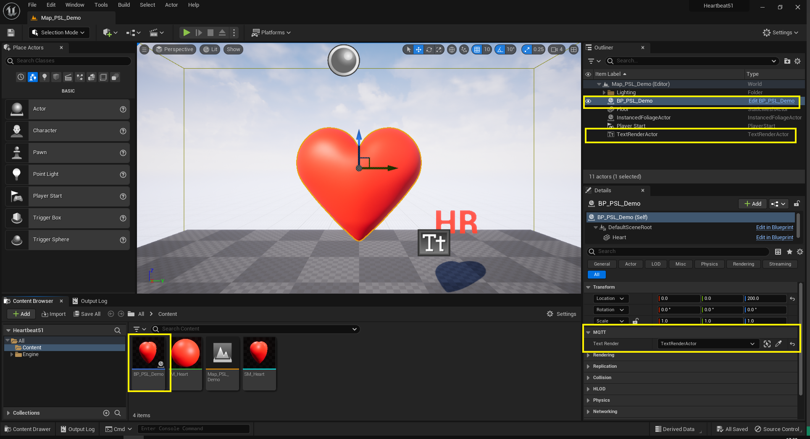
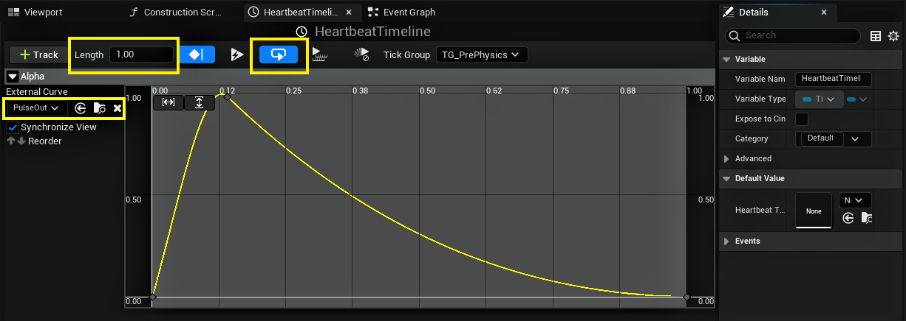
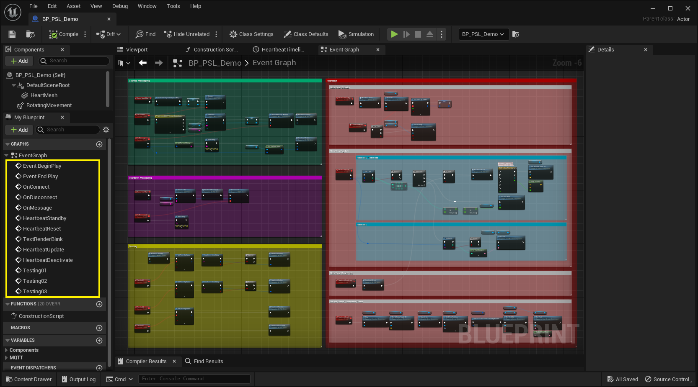
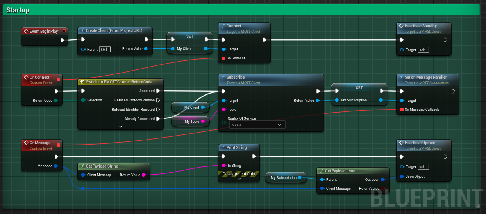
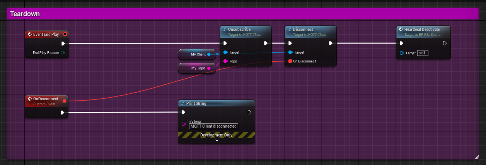
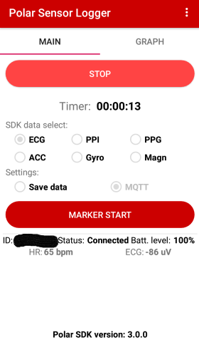
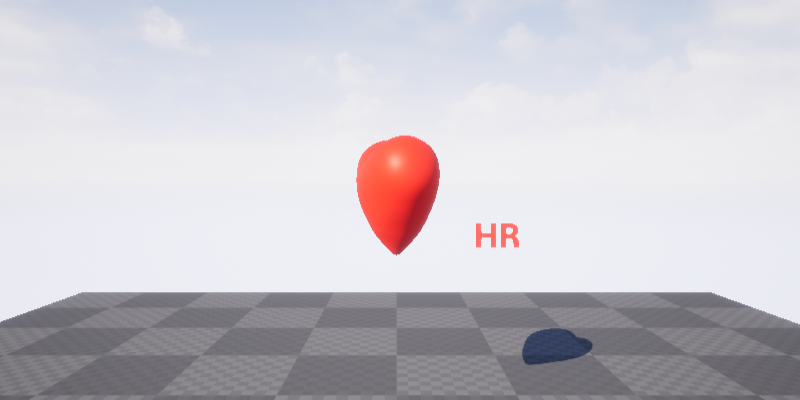
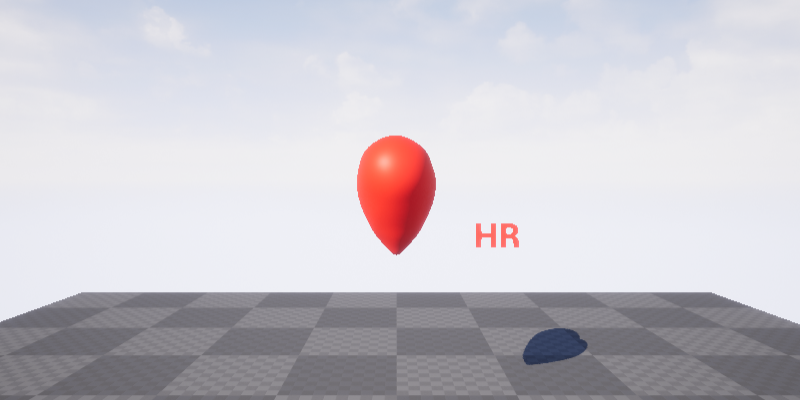
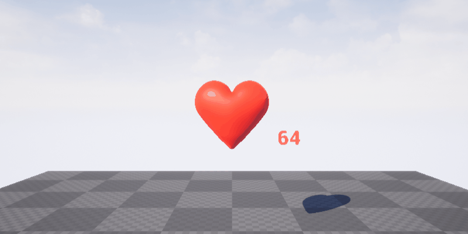

# Unreal Engine Project "Heartbeat" &ndash; Readme

* Author: Copyright 2023 Roland Bruggmann aka brugr9
* Profile on UE Marketplace: [https://www.unrealengine.com/marketplace/profile/brugr9](https://www.unrealengine.com/marketplace/profile/brugr9)
* Profile on Epic Developer Community: [https://dev.epicgames.com/community/profile/PQBq/brugr9](https://dev.epicgames.com/community/profile/PQBq/brugr9)

---


Unreal Engine Project "Heartbeat" &mdash; Heart Rate Monitoring Integration

## Description

An Unreal&reg; Engine project as proof-of-concept for receiving physiological data from Polar&reg; H10 heart rate monitor.

* Index Terms:
  * Physiological Measuring, Electrocardiogram, Heart Rate
  * Integration, Messaging, PubSub, Internet of Things, Machine to Machine
* Technology:
  * Unreal Engine, Polar H10 HR Sensor with Chest Strap, Polar Sensor Logger, Mosquitto
  * Bluetooth, USB, MQTT, JSON
  * Windows PowerShell, Chocolatey Package Manager, Android Debug Bridge, Wireshark

* Tags: UE, PolarH10, ECG, HR, HRM, PSL, ADB, BLE, USB, PubSub, MQTT, JSON, IOT, M2M

---

<div style='page-break-after: always'></div>

## Table of Contents

<!-- Start Document Outline -->

* [1. Concept](#1-concept)
* [2. Setup](#2-setup)
  * [2.1. Firewall](#21-firewall)
  * [2.2. Wireshark](#22-wireshark)
  * [2.3. Unreal Engine](#23-unreal-engine)
  * [2.4. Mosquitto](#24-mosquitto)
  * [2.5. Android Debug Bridge](#25-android-debug-bridge)
  * [2.6. Polar Sensor Logger](#26-polar-sensor-logger)
* [3. Visualisation](#3-visualisation)
  * [3.1. Messaging Startup](#31-messaging-startup)
  * [3.2. Heartbeat Standby](#32-heartbeat-standby)
  * [3.3. Heartbeat Update](#33-heartbeat-update)
  * [3.4. Messaging Teardown](#34-messaging-teardown)
* [Appendix](#appendix)
  * [Acronyms](#acronyms)
  * [Glossary](#glossary)
  * [A. References](#a-references)
  * [B. Readings](#b-readings)
  * [C. Acknowledgements](#c-acknowledgements)
  * [D. Attribution](#d-attribution)
  * [E. Disclaimer](#e-disclaimer)
  * [F. Citation](#f-citation)

<!-- End Document Outline -->

<div style='page-break-after: always'></div>

## 1. Concept

We implement a general data flow as shown in listing 1.1.

*Listing 1.1.: General Data Flow*
> **Data Producer** &mdash;(*MQTT*)&rarr; **MQTT-Broker** &mdash;(*MQTT*)&rarr; **MQTT-Client**

We use system components as follows (for the specific data flow see Listing 1.2.):

* Data Producer:
  * Polar H10 Heart Rate (HR) Sensor with Chest Strap (cp. [1])
  * Android App "Polar Sensor Logger" (PSL) (cp. [2])
* MQTT-Broker "Mosquitto" as a Windows Service (cp. [6])
* "Unreal Engine" MQTT-Client from IOT-plugin "MQTT"

*Listing 1.2.: Specific Data Flow*
> Polar H10 &ndash;(*Polar BLE SDK*)&rarr; **Polar Sensor Logger** &ndash;(*MQTT*)&rarr; **Mosquitto** &ndash;(*MQTT*)&rarr; **Unreal Engine**

The following shows the setup in reverse order of the data flow: Unreal Engine and Mosquitto on Windows&mdash;were we furthermore configure the firewall, use Wireshark adn Android Debug Bridge&mdash;and on Android we setup Polar Sensor Logger.

<div style='page-break-after: always'></div>

## 2. Setup

### 2.1. Firewall

MQTT standard port is 1883, we will use TCP as transport. In the Windows Defender Firewall allow TCP port 1883, e.g., by using an administrative PowerShell (see listing 2.1.).

*Listing 2.1.: Firewall Rule "Allow TCP Port 1883"*
```PowerShell
New-NetFirewallRule -DisplayName "Allow TCP Port 1883" -Direction inbound -Profile Any -Action Allow -LocalPort 1883 -Protocol TCP
```

### 2.2. Wireshark

We make use of Wireshark to monitor the MQTT messages sent over port 1883 (cp. [4] and [5]).

1. Launch an administrative PowerShell and install Wireshark, e.g., by using Chocolatey packet manager  (cp. [3], see listing 2.2.).
2. Startup Wireshark and filter TCP port 1883 (see listing 2.3. and figure 2.1.).

*Listing 2.2.: Use of Chocolatey to Install Wireshark*
```PowerShell
choco install wireshark
```

*Listing 2.3.: Wireshark Filter TCP Port 1883*
```
tcp.port == 1883
```


*Figure 2.1.: Wireshark Dissecting Port 1883*

<div style='page-break-after: always'></div>

### 2.3. Unreal Engine

Clone UE project "Heartbeat" using git, e.g., by ```git clone https://github.com/brugr9/Heartbeat51.git``` and startup the project.

#### 2.3.1. Plugin MQTT

UE project "Heartbeat" makes use of built-in IOT plugin "MQTT" (see figure 2.2.). Note: With UE 5.1 as of January 2023, the plugin is Beta and is not yet documented.


*Figure 2.2.: Unreal Engine Plugins Browser Tab with Built-in IOT Plugin "MQTT"*

#### 2.3.2. MQTT Subscription

Map `Map_PSL_Demo` holds a Blueprint `BP_PSL_Demo` instance and additionally a TextRenderActor instance, which is assigned to the `BP_PSL_Demo` variable 'TextRender' as Object Reference (see figure 2.3.).


*Figure 2.3.: Map_PSL_Demo with BP_PSL_Demo and TextRenderActor in the Outliner and in the Viewport*

<div style='page-break-after: always'></div>

Blueprint `BP_PSL_Demo` has components as follows (see figure 2.4.):

* Scene Components:
  * Static Mesh Component `HeartMesh`
* Actor Components:
  * Rotating Movement Component
  * Timeline Component `HeartbeatTimeline`: Default asset curve template `PulseOut` (see figure 2.5.)

Blueprint `BP_PSL_Demo` has variables as follows (see figure 2.4.):

* String `MyTopic`, default value set to `psl/hr`
* MQTT-Client Object Reference `MyClient`
* MQTT-Subscription Object Reference `MySubscription`
* TextRenderActor Object Reference `TextRender` (public)
* Timer Handle `TextRenderVisibilityTimer`


*Figure 2.4.: Blueprint BP_PSL_Demo, Variable TextRender*


*Figure 2.5.: Blueprint BP_PSL_Demo, Timeline Component HeartbeatTimeline*

<div style='page-break-after: always'></div>

Blueprint `BP_PSL_Demo` has events as follows (see figure 2.6.):

* Gameplay: EventBeginPlay, EventEndPlay
* Messaging: OnConnect, OnDisconnect, OnMessage
* Visualisation:
  * Main: HeartbeatStandby, HeartbeatUpdate, HeartbeatDeactivate
  * Helpers: TextRenderBlink, HeartbeatReset
* Testing: Testing01, Testing02, Testing03


*Figure 2.6.: Blueprint BP_PSL_Demo, Event Graph Overview*

<div style='page-break-after: always'></div>

##### 2.3.2.1. Messaging Startup

On `EventBeginPlay` an MQTT-Client is created and connected. `OnConnect`, if the connection was accepted, the topic is subscribed. With event `HeartbeatStandby` the Mesh Component 'heart' starts rotating and the TextRender-Actor starts blinking. `OnMessage` the received message is evaluated by calling event `HeartbeatUpdate` (see figure 2.7.).


*Figure 2.7.: Blueprint BP_PSL_Demo, Event Graph with Startup*

##### 2.3.2.2. Messaging Teardown

On `EventEndPlay` the topic is unsubscribed. With event `HeartbeatDeactivate` the Mesh Component 'heart' and the TextRender-Actor stop its animation. Then the MQTT-Client is disconnected, `OnDisconnect` a we print a string to the output log (see figure 2.8.).


*Figure 2.8.: Blueprint BP_PSL_Demo, Event Graph with Teardown*

<div style='page-break-after: always'></div>

### 2.4. Mosquitto

Install Mosquitto MQTT-Broker (cp. [6]) and start the Windows Service "Mosquitto Broker" (see figure 2.9.).


*Figure 2.9.: Mosquitto Broker as Windows Service*

<div style='page-break-after: always'></div>

### 2.5. Android Debug Bridge

On the Android device enable USB Debugging mode (cp. [7]):

> 1. Launch the `Settings` application.
> 2. Tap the `About Phone` option (generally found near the bottom of the list).
> 3. Then tap the `Build Number` option *7 times* to enable *Developer Mode*. You will see a toast message when it is done.
> 4. Now go back to the main `Settings` screen and you should see a new `Developer Options` menu you can access.
> 5. Go in there and enable the `USB Debugging` mode option.
> 6. Connect the Android device to the PC by USB cable.

On the PC setup "Android Debug Bridge" ADB (cp. [7]):

1. Launch an administrative PowerShell
   1. Install "Android Debug Bridge", e.g., by using Chocolatey packet manager (cp. [3], see listing 2.4.)
   2. Startup the "Android Debug Bridge" with mapping TCP port 1883 bidirectional (cp. [8], see listing 2.5. and listing 2.6.)
2. Back on the Andorid, a prompt "Allow USB Debugging" is shown, accept by hitting `OK`

*Listing 2.4.: Use of Chocolatey to Install Android Debug Bridge*
```PowerShell
choco install adb
```

*Listing 2.5.: Android Debug Bridge Startup*
```PowerShell
adb reverse tcp:1883 tcp:1883
```

*Listing 2.6.: Android Debug Bridge Feedback*
```PowerShell
* daemon not running; starting now at tcp:5037
* daemon started successfully
```

<div style='page-break-after: always'></div>

### 2.6. Polar Sensor Logger

Mount the Polar H10 sensor on the chest strap and wear the same. On the Android device ...

1. Install the "Polar Sensor Logger" App (cp. [2])
2. Activate Bluetooth
3. Activate Location Service
4. Launch the "Polar Sensor Logger" App, in the main tab configure as follows:
   1. "SDK data select:" check `ECG` solely (cp. figure 2.10.).
   2. "Settings:" check `MQTT` solely (cp. figure 2.10.).
      * In the pop-up "MQTT-serttings" configure (cp. figure 2.11.):
         * MQTT-broker address: `127.0.0.1`
         * Port: `1883`
         * Topic: `psl`
         * Client ID: e.g. `MyPSL-01`
      * Hit `OK`
   3. Hit `SEEK SENSOR`
      * Select listed sensor `Polar H10 12345678` (ID will differ) (cp. figure 2.12.)
      * Hit `OK`

|  |  |  |  |
|:-------------------------:|:-------------------------:|:-------------------------:|:-------------------------:|
| *Figure 2.10.: PSL, Main Tab* | *Figure 2.11.: PSL, Dialogue "MQTT Settings"* | *Figure 2.12.: PSL, Dialogue "Seek Sensor"* | *Figure 2.13.: PSL, Main Tab, Connected* |

<div style='page-break-after: always'></div>

With Polar Sensor Logger main tab entry "SDK data select" option *ECG* activated, two topics are delivered: topic `psl/ecg` with a payload containing field `"ecg": [ ... ]` which delivers ECG values in microvolts [uV] (cp. listing 2.7.) and topic `psl/hr` where field ```"hr": 64``` corresponds to the heart rate in beats per minute (bpm) and field ```"rr": [ 938 ]``` corresponds to the RR interval in milliseconds [ms]. (cp. listing 2.8.). We consume the latter only.

*Listing 2.7.: Topic psl/ecg, example Payload in JSON*
```json
{
  "clientId": "MyPSL-01",
  "deviceId": "12345678",
  "sessionId": 1234567890,
  "sampleRate": 130,
  "timeStamp": 1234567890123,
  "sensorTimeStamp": 123456789012345678,
  "ecg": [
    -91,
    -91,
    -103,
    -117,
    -117
  ]
}
```

*Listing 2.8.: Topic psl/hr, example Payload in JSON*
```json
{
  "clientId": "MyPSL-01",
  "deviceId": "12345678",
  "sessionId": 1234567890,
  "timeStamp": 1234567890123,
  "hr": 64,
  "rr": [
    938
  ]
}
```

<div style='page-break-after: always'></div>

## 3. Visualisation

### 3.1. Messaging Startup

In Unreal Editor with Level `Map_PSL_Demo` open, click the `Play` button &#9658; in the level editor to start Play-in-Editor (PIE). The MQTT plugin writes to the output log with custom log category `LogMQTTCore` (see listing 3.1.).

*Listing 3.1.: Output Log of Map_PSL_Demo starting PIE*
```
[...]
LogWorld: Bringing World /Game/UEDPIE_0_Map_PSL_Demo.Map_PSL_Demo up for play (max tick rate 0)
LogWorld: Bringing up level for play took: 0.000950
LogOnline: OSS: Created online subsystem instance for: :Context_6
LogMQTTCore: VeryVerbose: Created MQTTConnection for 127.0.0.1
LogMQTTCore: Display: Created new Client, Num: 1
LogMQTTCore: Verbose: Set State to: Connecting
LogMQTTCore: Verbose: Queued Subscribe message with PacketId 1., and Topic Filter: 'psl/hr'
PIE: Server logged in
PIE: Play in editor total start time 0.132 seconds.
LogMQTTCore: Verbose: Copy outgoing operations to buffer
LogMQTTCore: Verbose: Operations deferred: 2
LogMQTTCore: Verbose: Processing incoming packets of size: 4
LogMQTTCore: Verbose: Set State to: Connected
LogMQTTCore: VeryVerbose: Handled ConnectAck message.
LogMQTTCore: Verbose: Copy outgoing operations to buffer
LogMQTTCore: Verbose: Operations deferred: 0
LogMQTTCore: Verbose: Processing incoming packets of size: 5
LogMQTTCore: VeryVerbose: Handled SubscribeAck message with PacketId 1.
LogMQTTCore: Verbose: Processing incoming packets of size: 2
LogMQTTCore: VeryVerbose: Handled PingResponse message.
LogMQTTCore: Verbose: Copy outgoing operations to buffer
LogMQTTCore: Verbose: Operations deferred: 0
LogMQTTCore: Verbose: Copy outgoing operations to buffer
LogMQTTCore: Verbose: Operations deferred: 0
[...]
```

<div style='page-break-after: always'></div>

Wireshark dissecting port 1883 lists, e.g., the `Connect Command` sent from the Unreal Engine MQTT client instance (see figure 3.2.).


*Figure 3.2.: Wireshark Dissecting Port 1883, Connect Command from Unreal Engine MQTT Client Instance*

### 3.2. Heartbeat Standby

With UE subscribing to an MQTT broker Blueprint `BP_PSL_Demo` calls event `HeartbeatStandby`, which starts a visual feedback by rotating the `HeartMesh` component and blinking the `TextRender` (see figures 3.1.1. and 3.1.2.).

|  |  |  |  |  |  |
|:----------:|:----------:|:----------:|:----------:|:----------:|:----------:|
*Figure 3.1.1.: Screenshots of Map_PSL_Demo PIE, Heartbeat Standby Mode*


*Figure 3.1.2.: Animation Screenshot of Map_PSL_Demo PIE, Heartbeat Standby Mode*

<div style='page-break-after: always'></div>

### 3.3. Heartbeat Update

With receiving MQTT messages Blueprint `BP_PSL_Demo` starts udating the visual feedback by calling event `HeartbeatUpdate`, the heart bumps frequently as given by RR-interval and the TextRender shows the heart rate (see figures 3.2.1 and 3.2.2. and listing 3.2.).

|  |  |  |  |  |  |
|:----------:|:----------:|:----------:|:----------:|:----------:|:----------:|
*Figure 3.2.1.: Screenshots of Map_PSL_Demo PIE, Heartbeat Update Mode*


*Figure 3.2.2.: Animation Screenshot of Map_PSL_Demo PIE, Heartbeat Update Mode*

*Listing 3.2.: Output Log of Map_PSL_Demo running PIE and logging the received Payloads*
```
[...]
LogMQTTCore: Verbose: Processing incoming packets of size: 157
LogMQTTCore: VeryVerbose: Handled Publish message.
LogBlueprintUserMessages: [BP_PSL_Demo_C_1] {
  "clientId": "MyPSL-01",
  "deviceId": "12345678",
  "sessionId": 1234567890,
  "timeStamp": 1234567890123,
  "hr": 64,
  "rr": [
    938
  ]
LogMQTTCore: Verbose: Processing incoming packets of size: 157
LogMQTTCore: VeryVerbose: Handled Publish message.
LogBlueprintUserMessages: [BP_PSL_Demo_C_1] {
  "clientId": "MyPSL-01",
  "deviceId": "12345678",
  "sessionId": 1234567890,
  "timeStamp": 1235678901234,
  "hr": 124,
  "rr": [
    484
  ]
[...]
```

### 3.4. Messaging Teardown

With stopping PIE the MQTT-Client disconnects (see listing 3.3.).

*Listing 3.3.: Output Log of Map_PSL_Demo stopping PIE*
```
[...]
LogWorld: BeginTearingDown for /Game/UEDPIE_0_Map_PSL_Demo
LogMQTTCore: Verbose: Set State to: Disconnecting
LogWorld: UWorld::CleanupWorld for Map_PSL_Demo, bSessionEnded=true, bCleanupResources=true
LogSlate: InvalidateAllWidgets triggered.  All widgets were invalidated
LogPlayLevel: Display: Shutting down PIE online subsystems
LogSlate: InvalidateAllWidgets triggered.  All widgets were invalidated
LogMQTTCore: Verbose: Copy outgoing operations to buffer
LogMQTTCore: Verbose: Operations deferred: 1
LogMQTTCore: Verbose: Set State to: Disconnected
LogAudio: Display: Audio Device unregistered from world 'None'.
LogAudioMixer: FMixerPlatformXAudio2::StopAudioStream() called. InstanceID=5
LogAudioMixer: FMixerPlatformXAudio2::StopAudioStream() called. InstanceID=5
LogSlate: Updating window title bar state: overlay mode, drag disabled, window buttons hidden, title bar hidden
LogMQTTCore: Verbose: Set State to: Stopping
LogMQTTCore: Verbose: Abandoning Operations
LogMQTTCore: Verbose: Abandoning Operations
LogMQTTCore: VeryVerbose: Destroyed MQTTConnection at 127.0.0.1
[...]
```

<div style='page-break-after: always'></div>

## Appendix

### Acronyms

* ADB &mdash; Android Debug Bridge
* BLE &mdash; Bluetooth Low Energy
* BPM &mdash; Beats per Minute
* ECG &mdash; Electrocardiogram
* HR &mdash; Heart Rate
* HRM &mdash; Heart Rate Monitor
* HRV &mdash; Heart Rate Variability
* IBI &mdash; Interbeat Interval
* IOT &mdash; Internet of Things
* JSON &mdash; JavaScript Object Notation
* M2M &mdash; Machine to Machine
* MQTT &mdash; Message Queuing Telemetry Transport
* PIE &mdash; Play-in-Editor
* POC &mdash; Proof-of-Concept
* PS &mdash; PowerShell
* PSL &mdash; Polar Sensor Logger
* QoS &mdash; Quality of Service
* RRI &mdash; RR Interval
* UE &mdash; Unreal Engine
* USB &mdash; Universal Serial Bus

<div style='page-break-after: always'></div>

### Glossary

#### MQTT &ndash; Quality of Service QoS

> *The Quality of Service (QoS) level is an agreement between the sender of a message and the receiver of a message that defines the guarantee of delivery for a specific message. There are 3 QoS levels in MQTT:*
>
> * *At most once (0)*
> * *At least once (1)*
> * *Exactly once (2)*
>
> *When you talk about QoS in MQTT, you need to consider the two sides of message delivery:*
>
> * *Message delivery form the publishing client to the broker.*
> * *Message delivery from the broker to the subscribing client.*
>
> *We will look at the two sides of the message delivery separately because there are subtle differences between the two. The client that publishes the message to the broker defines the QoS level of the message when it sends the message to the broker. The broker transmits this message to subscribing clients using the QoS level that each subscribing client defines during the subscription process. If the subscribing client defines a lower QoS than the publishing client, the broker transmits the message with the lower quality of service.*
(HiveMQ, cp. [9.1])

#### MQTT &ndash; Retain

> *A retained message is a normal MQTT message with the retained flag set to true. The broker stores the last retained message and the corresponding QoS for that topic. Each client that subscribes to a topic pattern that matches the topic of the retained message receives the retained message immediately after they subscribe. The broker stores only one retained message per topic.*
(HiveMQ, cp. [9.2])

#### HRM &ndash; Heart Rate Variability

In a healthy person, the heart does not beat with a fixed frequency, i.e. with a resting pulse of, for example, 60 heartbeats per minute, each beat does not occur after exactly one second or 1000 milliseconds. Fluctuations of 30 to 100 milliseconds in the heartbeat sequence occur as a natural mode of operation of the heart.

> *Heart rate variability (HRV) is the amount by which the time interval between successive heartbeats (interbeat interval, IBI) varies from beat to beat. The magnitude of this variability is small (measured in milliseconds), and therefore, assessment of HRV requires specialized measurement devices and accurate analysis tools. Typically HRV is extracted from an electrocardiogram (ECG) measurement by measuring the time intervals between successive heartbeats [...].*
*Heart rate variability in healthy individuals is strongest during rest, whereas during stress and physical activity HRV is decreased. The magnitude of heart rate variability is different between individuals. High HRV is commonly linked to young age, good physical fitness, and good overall health.*
(Kubios, cp. [10]).

#### HRM &ndash; RR Interval

The RR interval RRI is an interbeat interval IBI, more precisely the time elapsed between two successive R-waves of the QRS signal on the electrocardiogram, in milliseconds [ms] (cp. [11] and [12]).

<div style='page-break-after: always'></div>

### A. References

* [1] Polar Electro: **Polar H10**. Heart Rate Sensor with Chest Strap, Online: [https://www.polar.com/en/sensors/h10-heart-rate-sensor](https://www.polar.com/en/sensors/h10-heart-rate-sensor)
* [2] Jukka Happonen: **Polar Sensor Logger**. App on Google Play, Online: [https://play.google.com/store/apps/details?id=com.j_ware.polarsensorlogger](https://play.google.com/store/apps/details?id=com.j_ware.polarsensorlogger)
* [3] **Chocolatey** &ndash; The Package Manager for Windows. Online: [https://chocolatey.org/](https://chocolatey.org/)
* [4] Abhinaya Balaji: **Dissecting MQTT using Wireshark**. In: Blog Post, July 6, 2017. Catchpoint Systems, Inc. Online: [https://www.catchpoint.com/blog/wireshark-mqtt](https://www.catchpoint.com/blog/wireshark-mqtt)
* [5] Wireshark Documentation: **Display Filter Reference: MQ Telemetry Transport Protocol**, Online: [https://www.wireshark.org/docs/dfref/m/mqtt.html](https://www.wireshark.org/docs/dfref/m/mqtt.html)
* [6] **Eclipse Mosquitto** &ndash; An open source MQTT broker. Online: [https://mosquitto.org/](https://mosquitto.org/)
* [7] Skanda Hazarika: **How to Install ADB on Windows, macOS, and Linux**. July 28, 2021. In: XDA Developers. Online: [https://www.xda-developers.com/install-adb-windows-macos-linux](https://www.xda-developers.com/install-adb-windows-macos-linux)
* [8] Tushar Sadhwani: **Connecting Android Apps to localhost, Simplified**. April 17, 2021. In: DEV Community, Online: [https://dev.to/tusharsadhwani/connecting-android-apps-to-localhost-simplified-57lm](https://dev.to/tusharsadhwani/connecting-android-apps-to-localhost-simplified-57lm)
* [9.1] HiveMQ Team: **Quality of Service (QoS) 0,1, & 2 MQTT Essentials: Part 6**. February 16, 2015. Online: [https://www.hivemq.com/blog/mqtt-essentials-part-6-mqtt-quality-of-service-levels/](https://www.hivemq.com/blog/mqtt-essentials-part-6-mqtt-quality-of-service-levels/)
* [9.2] HiveMQ Team: **Retained Messages - MQTT Essentials: Part 8**. March 2, 2015. Online: [https://www.hivemq.com/blog/mqtt-essentials-part-8-retained-messages/](https://www.hivemq.com/blog/mqtt-essentials-part-8-retained-messages/)
* [10] **Heart Rate Variability**. In: Website of Kubios Oy, Section "HRV Resources". Online: [https://www.kubios.com/about-hrv/](https://www.kubios.com/about-hrv/)
* [11]  **RR Interval**. In: ScienceDirect. From: Principles and Practice of Sleep Medicine (Fifth Edition), 2011. Online: [https://www.sciencedirect.com/topics/nursing-and-health-professions/rr-interval](https://www.sciencedirect.com/topics/nursing-and-health-professions/rr-interval)
* [12] Mike Cadogan: **R wave Overview**. February 4, 2021. In: Live In The Fastlane &ndash; ECG Library, ECG Basics. Online: [https://litfl.com/r-wave-ecg-library/](https://litfl.com/r-wave-ecg-library/)

### B. Readings

* Ch&#281;&cacute;, A.; Olczak, D.; Fernandes, T. and Ferreira, H. (2015). **Physiological Computing Gaming - Use of Electrocardiogram as an Input for Video Gaming**. In: Proceedings of the 2nd International Conference on Physiological Computing Systems - PhyCS, ISBN 978-989-758-085-7; ISSN 2184-321X, pages 157-163. DOI: [10.5220/0005244401570163](http://dx.doi.org/10.5220/0005244401570163)

### C. Acknowledgements

* Logo: "**A red heart with a heartbeat to the right**", by Diego Naive / Joe Sutherland, June 6, 2018. Online: [https://de.wikipedia.org/wiki/Datei:Red_heart_with_heartbeat_logo.svg](https://de.wikipedia.org/wiki/Datei:Red_heart_with_heartbeat_logo.svg), licensed [CC BY 4.0](http://creativecommons.org/licenses/by/4.0/).
* 3D Model: "**Heart**", by phenopeia, January 16, 2015. Online: [https://skfb.ly/CCyL](https://skfb.ly/CCyL), licensed [CC BY 4.0](http://creativecommons.org/licenses/by/4.0/).

<div style='page-break-after: always'></div>

### D. Attribution

* The word mark Unreal and its logo are Epic Games, Inc. trademarks or registered trademarks in the US and elsewhere.
* The word mark Polar and its logos are trademarks of Polar Electro Oy.
* Android is a trademark of Google LLC.
* The Bluetooth word mark and logos are registered trademarks owned by Bluetooth SIG, Inc.
* Windows and PowerShell are registered trademarks of Microsoft Corporation.
* The Chocolatey package manager software and logo are trade marks of Chocolatey Software, Inc.
* Mosquitto is a registered trade mark of the Eclipse Foundation.
* Wireshark and the "fin" logo are registered trademarks of the Wireshark Foundation.

### E. Disclaimer

This documentation has **not been reviewed or approved** by the *Food and Drug Administration FDA* or by any other agency. It is the users responsibility to ensure compliance with applicable rules and regulations&mdash;be it in the US or elsewhere.

### F. Citation

To acknowledge this work, please cite

> Bruggmann, R. (2023): Unreal&reg; Engine Project "Heartbeat" [Computer software], Version v5.1.0. Licensed under Creative Commons Attribution-ShareAlike 4.0 International. Online: https://github.com/brugr9/heartbeat51

```bibtex
@software{Bruggmann_Heartbeat_2023,
  author = {Bruggmann, Roland},
  year = {2023},
  version = {v5.1.0},
  title = {{Unreal Engine Project 'Heartbeat'}},
  url = {https://github.com/brugr9/heartbeat51}
}
```

---
<!-- Footer -->

[](https://creativecommons.org/licenses/by-sa/4.0/)

*Unreal&reg; Engine Project "Heartbeat"* &copy; 2023 by [Roland Bruggmann](https://about.me/rbruggmann) is licensed under [Creative Commons Attribution-ShareAlike 4.0 International](http://creativecommons.org/licenses/by-sa/4.0/)
